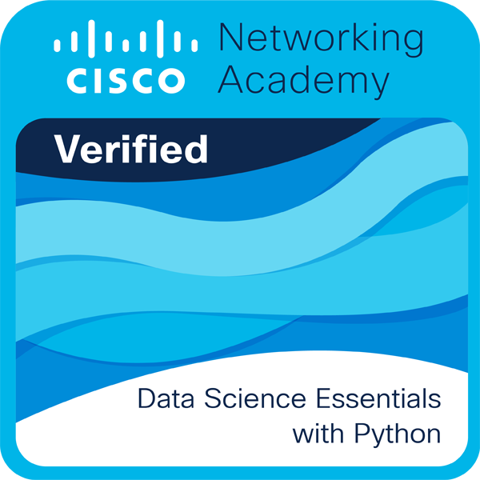

<h1 align="center">Hola 👋  soy Andres Sebastian Urrego Amaya </h1> 

  

 
<h2>Sobre mi 😃</h2>

🎓 ESTUDIANTE DE CIENCIAS DE LA COMPUTACION E INTELIGENCIA ARTIFICIAL

📝 ACTUALMENTE ESTUDIANTE EN LA UNIVERSIDAD SERGIO ARBOLEDA SEDE BOGOTÁ

💻 INTENTO APRENDER CADA DIA ALGO NUEVO Y ASI MEJORAR EN LO QUE HAGO (CIENCIA DE DATOS, CIBERSEGURIDAD Y DESARROLLADOR FRONTEND)

📫 Contacto: **sebasu0302@gmail.com**
<!--Intro end-->
  

 

<h2 >Tecnologías conocidas👨🏻‍💻</h2>
<!--tech stack icons-->

  

 

<section>
    <h2>🏅 Certificados de Cursos</h2>
    
</section>
